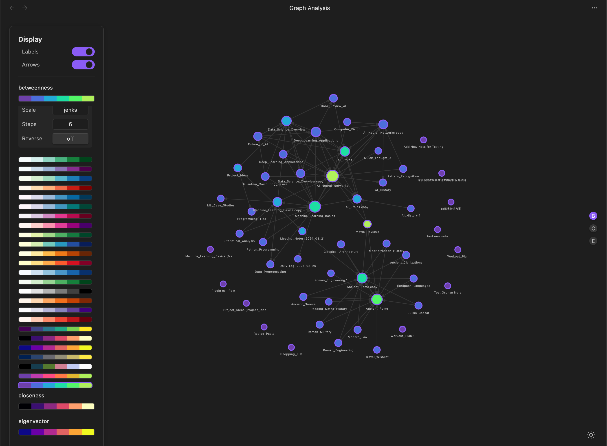
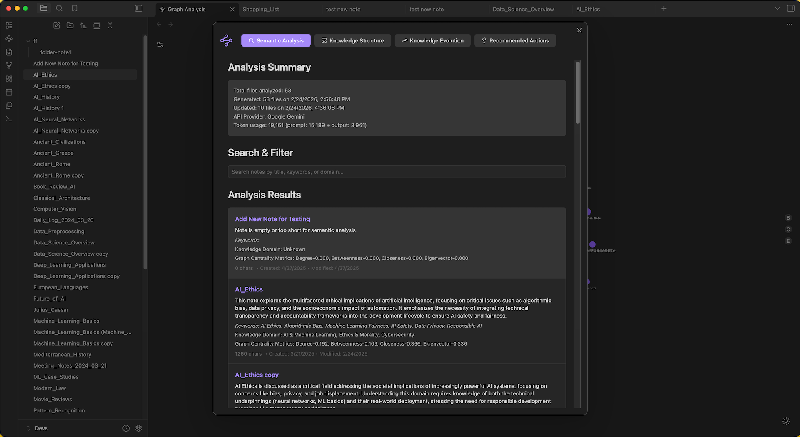
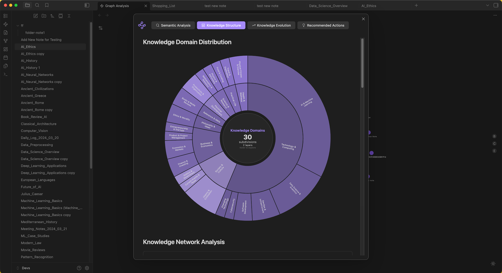
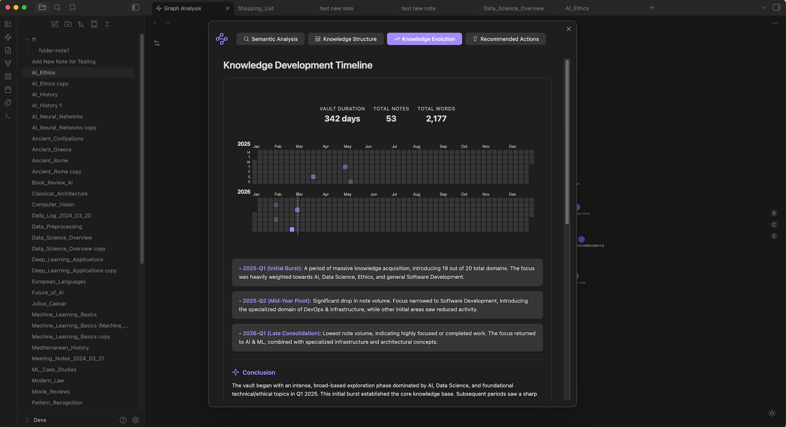
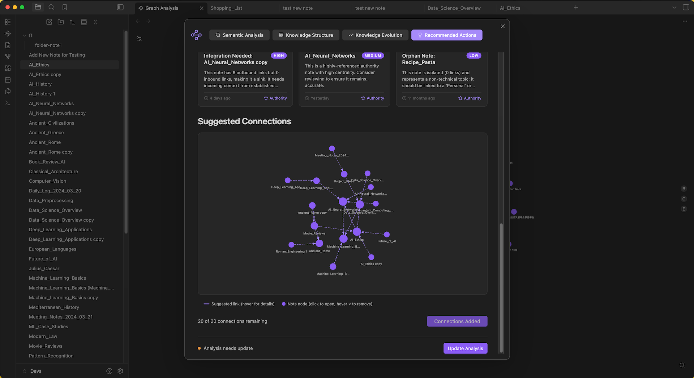

# Knowledge Graph Analysis

An [Obsidian](https://obsidian.md) plugin that turns your vault into a knowledge graph, then feeds those graph-theory metrics to AI — giving it structured, quantitative context instead of raw note content. The result: deeper insights into how your knowledge is organized, how it evolves, and what to do next.


## Why Graph Theory + AI?

Most AI tools analyze notes by reading their text. That works for summaries, but it can't tell you which notes hold your vault together, where structural gaps exist, or how your thinking has shifted over time.

This plugin takes a different approach. It first computes real graph metrics — degree, betweenness, closeness, and eigenvector centrality — across your entire vault. These metrics are well-defined, reproducible, and reveal structure that no amount of text reading can surface. The AI then reasons over this structured data, producing analysis that is grounded in the actual topology of your knowledge, not just keywords.

**Graph metrics → AI context → deeper insights → concrete actions.**

## Features

- **Interactive Graph View** — Force-directed visualization with centrality-based node sizing, color coding, and hover details
- **Four-Tab Vault Analysis** — Semantic Analysis, Knowledge Structure, Knowledge Evolution, and Recommended Actions
- **Suggested Connections** — AI-identified links you can add to your vault in one click
- **Priority Review Cards** — Surface hubs, bridges, and authorities that need attention
- **Exclusion Rules** — Filter out folders and tags; the graph refreshes automatically
- **AI Note Summaries** — Quick per-note summaries via Google Gemini from the status bar

## Installation

### From Obsidian Community Plugins

*Coming soon.*

### Manual Installation

1. Download the latest release from the [releases page](https://github.com/luolanaaTUD/obsidian-graph-analysis/releases)
2. Extract the zip into your vault's `.obsidian/plugins/` directory
3. Enable **Knowledge Graph Analysis** in Obsidian settings under Community Plugins

## Interactive Graph View

The graph renders your vault as a network — notes are nodes, links are edges. Node size reflects degree centrality (more connections → larger node), and color can encode betweenness, closeness, or eigenvector centrality.

- **Settings panel** (top-left): Toggle node labels, connection arrows, and color strip
- **Hover**: Highlights adjacent connections and shows centrality scores
- **Drag**: Reposition nodes; the force layout updates in real time



## Vault Analysis

Open the **Vault Analysis** modal from the status bar or command palette. The plugin first computes graph metrics in WASM, then runs AI analysis via Google Gemini. Results are organized into four tabs — Semantic Analysis produces the base data, and the other three tabs build on it independently.

### Semantic Analysis

The foundation layer. The AI processes each note alongside its graph metrics and produces:



- **Summary** — One-sentence description of the note's core concept
- **Keywords** — 3–6 key terms
- **Knowledge Domains** — 2–4 academic or professional fields

Results are searchable, paginated, and update incrementally — only changed or new notes are re-analyzed.

### Knowledge Structure

Reveals how your knowledge is organized by combining domain analysis with graph topology.



- **Domain Distribution** — Sunburst chart of knowledge domains across your vault
- **Network Analysis** — KDE centrality distributions plus AI-identified Knowledge Bridges (high betweenness), Foundations (high closeness), and Authorities (high eigenvector)
- **Knowledge Gaps** — Areas the AI identifies as underdeveloped based on graph structure and domain coverage

### Knowledge Evolution

Tracks how your vault grows and shifts over time.



- **Development Timeline** — Calendar heatmap of note creation with AI-generated phases and narrative
- **Topic Introduction Patterns** — When new topics and domains first appeared
- **Focus Shift Analysis** — Compares recent activity against historical patterns to surface notable shifts

### Recommended Actions

Turns analysis into concrete next steps.



- **Network Metrics** — Scatter plots of Inbound vs Outbound links and Betweenness vs Eigenvector centrality
- **Notes Needing Review** — Priority cards (high / medium / low) for hubs, bridges, and authorities that may be stale or under-connected
- **Suggested Connections** — An interactive sub-graph of notes the AI recommends linking. Remove unwanted suggestions, then click **Add to Main Graph** to write `[[links]]` directly into your notes

## AI Note Summary

For a quick summary of the current note, click **AI Summary** in the status bar. Requires a Gemini API key.

**Getting a Gemini API key:** Visit [Google AI Studio](https://aistudio.google.com/), sign in, create an API key, and paste it into plugin settings under "LLM Model Configuration".

## Settings

Under Obsidian settings → **Knowledge Graph Analysis**:

| Setting | Description |
|---|---|
| **Exclude Folders** | Comma-separated paths (e.g. `Archive, Templates`). Real-time stats show excluded vs included counts. |
| **Exclude Tags** | Comma-separated tags without `#` (e.g. `private, draft`). |
| **Gemini API Key** | Required for AI analysis and summaries. |
| **Visualization** | Graph appearance options in the graph view settings panel. |

## Technical Details

- **TypeScript** for the Obsidian plugin interface and UI
- **Rust → WebAssembly**: Graph algorithms (degree, betweenness, closeness, eigenvector centrality, force-directed layout) run in Rust compiled to WASM via [rustworkx](https://github.com/rustworkx/rustworkx), delivering native-speed computation in the browser
- **Google Gemini Flash Lite**: Structured JSON output with temperature 0.3 — cost-efficient on the free tier, sufficient for summaries, keywords, and domain extraction
- **Incremental analysis**: Only changed or new notes are re-processed; tab-specific results are cached separately
- **Single consolidated AI call**: Tabs 2–4 are generated from one master analysis call, reducing token usage by ~75%

## Build

**Prerequisites:** Node.js, npm, Rust, and [wasm-pack](https://rustwasm.github.io/wasm-pack/installer/).

```bash
git clone https://github.com/yourusername/obsidian-graph-analysis.git
cd obsidian-graph-analysis
npm install
npm run build
```

`npm run build` runs three steps in order:
1. **typecheck** — TypeScript type checking
2. **build-wasm** — Compiles the Rust graph library to WebAssembly via `wasm-pack build --target web`
3. **build:ts** — Bundles the plugin with esbuild, outputs to `dist/`, and copies WASM assets

To install into a vault, copy `dist/` contents into `.obsidian/plugins/obsidian-graph-analysis/`, or use `npm run copy-to-vault` if configured.

## Contributing

Contributions are welcome. Please feel free to submit a Pull Request.

## License

MIT — see the [LICENSE](LICENSE) file for details.

## Acknowledgments

- The [Obsidian](https://obsidian.md) team for the knowledge management platform
- The [rustworkx](https://github.com/rustworkx/rustworkx) team for the graph processing library
- The Rust and WebAssembly communities
