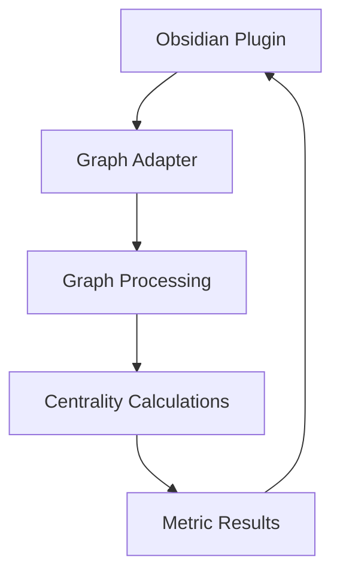

# System Patterns

## Architecture Overview
The system follows a modular architecture with clear separation between graph processing and plugin integration.

## Core Components
1. Graph Processing Module
   - Handles all network analysis calculations
   - Currently using petgraph, migrating to rustnetworkx-core
   - Maintains centrality calculation interfaces

2. Metric Calculation Patterns
   - Each centrality metric (degree, eigenvector, betweenness, closeness) is handled separately
   - Results are passed back to the Obsidian plugin layer

## Design Patterns
1. Adapter Pattern
   - Used to interface between Obsidian's data structure and graph processing
   - Will need updating during rustnetworkx-core migration

2. Strategy Pattern
   - Different centrality calculations implemented as separate strategies
   - Allows for easy testing and maintenance

## Component Relationships

## Migration Strategy
1. Implement parallel rustnetworkx-core solutions
2. Verify results against current petgraph implementation
3. Switch to new implementation
4. Remove petgraph dependency