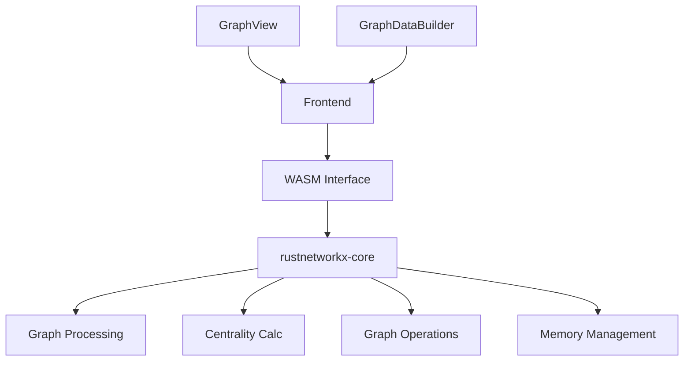
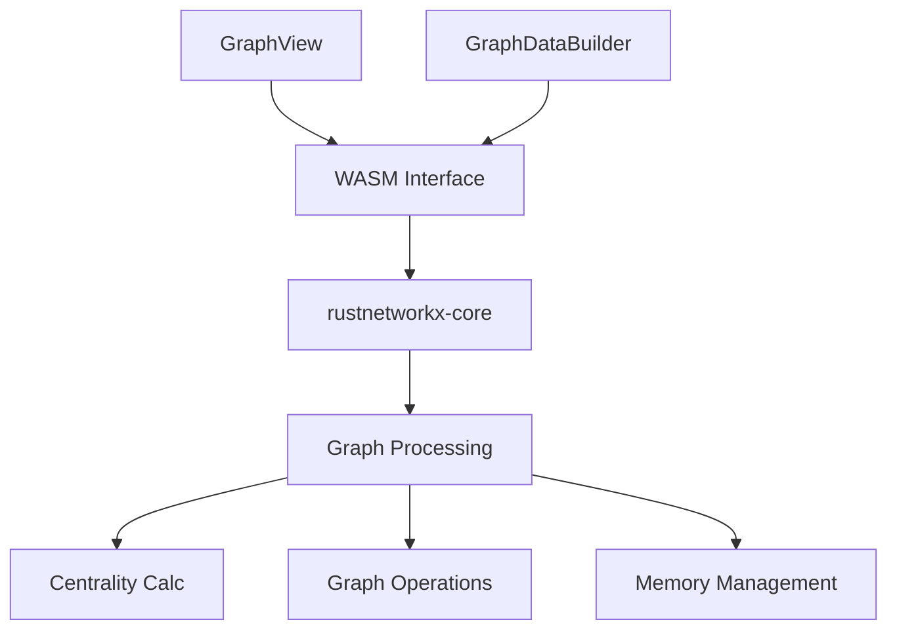

# System Patterns

## Architecture Overview
The system now utilizes rustnetworkx-core for efficient graph operations, providing optimized performance and enhanced capabilities for graph analysis.

## Core Components
1. Graph Processing Layer
   - rustnetworkx-core integration
   - Optimized centrality calculations
   - Efficient memory management
   - Enhanced performance

2. Graph Components
   - GraphView: UI and visualization
   - GraphDataBuilder: Data preparation
   - Optimized data flow
   - Efficient processing

## Implementation Pattern

## Design Patterns
1. Graph Processing Pattern
   - rustnetworkx-core based
   - Optimized operations
   - Memory efficiency
   - Performance focus

2. Data Flow Pattern
   - Efficient processing
   - Optimized calculations
   - Smart memory usage
   - Fast operations

3. Component Communication
   - Clean interfaces
   - Efficient data transfer
   - Type safety
   - Error handling

## Component Relationships

## Implementation Strategy
1. Graph Layer:
   - rustnetworkx-core integration
   - Optimized processing
   - Memory efficiency
   - Performance focus

2. Operations:
   - Fast calculations
   - Efficient memory use
   - Optimized algorithms
   - Enhanced performance

3. Future Enhancements:
   - Additional metrics
   - Performance optimization
   - Memory improvements
   - New capabilities