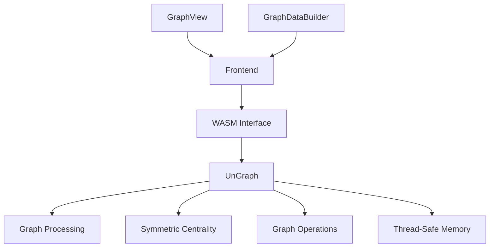
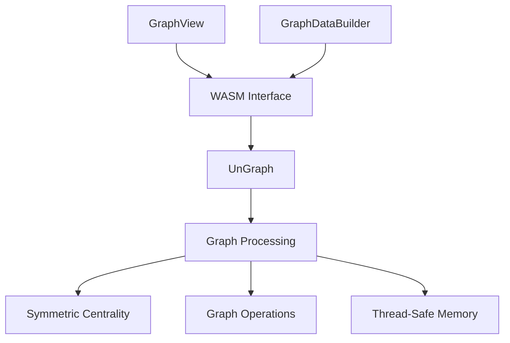

# System Patterns

## Architecture Overview
The system now utilizes rustworkx-core's UnGraph for undirected graph operations, providing optimized performance and enhanced capabilities for symmetric relationship analysis.

## Core Components
1. Graph Processing Layer
   - UnGraph from rustworkx-core
   - Symmetric centrality calculations
   - Thread-safe memory management
   - Enhanced performance
   - Mutex-based concurrency

2. Graph Components
   - GraphView: UI and visualization
   - GraphDataBuilder: Data preparation
   - Optimized data flow
   - Efficient processing
   - Undirected edge handling

## Implementation Pattern

## Design Patterns
1. Graph Processing Pattern
   - UnGraph based
   - Symmetric operations
   - Thread-safe memory
   - Performance focus
   - Mutex protection

2. Data Flow Pattern
   - Efficient processing
   - Symmetric calculations
   - Smart memory usage
   - Fast operations
   - Safe concurrency

3. Component Communication
   - Clean interfaces
   - Efficient data transfer
   - Type safety
   - Error handling
   - Thread safety

## Component Relationships

## Implementation Strategy
1. Graph Layer:
   - UnGraph integration
   - Symmetric processing
   - Thread-safe memory
   - Performance focus
   - Mutex protection

2. Operations:
   - Symmetric calculations
   - Thread-safe memory
   - Optimized algorithms
   - Enhanced performance
   - Safe concurrency

3. Future Enhancements:
   - Additional metrics
   - Performance optimization
   - Memory improvements
   - New capabilities
   - Enhanced thread safety