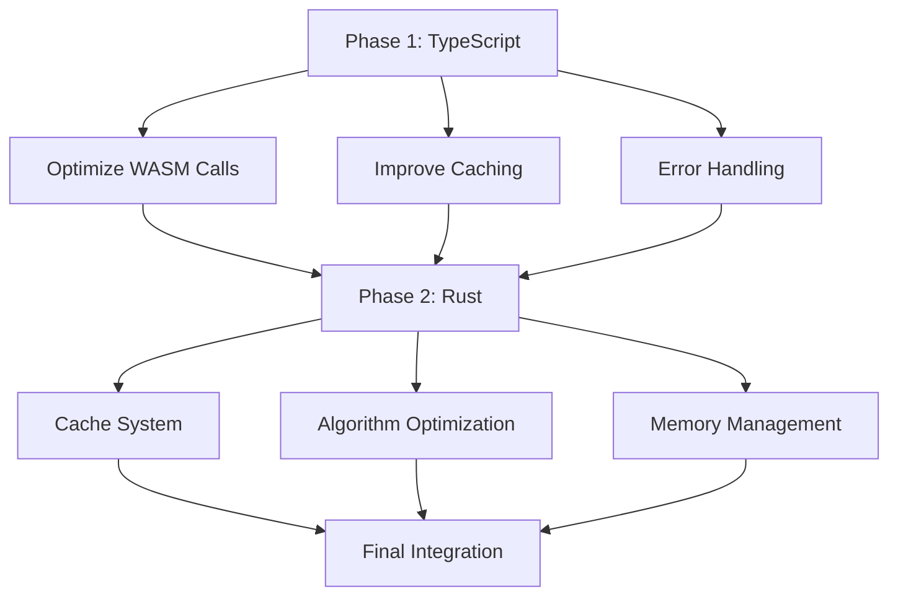
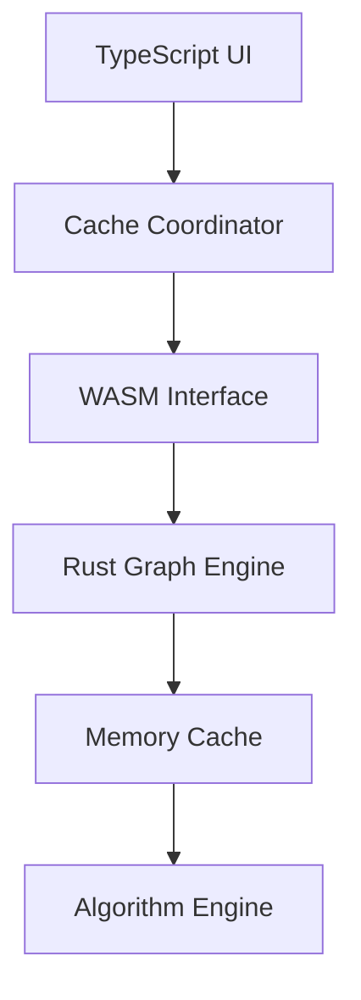

# System Patterns

## Architecture Overview
The system is being optimized for better performance and resource utilization, focusing on efficient WASM integration and graph operations.

## Core Components
1. TypeScript Layer (Current Focus)
   - Graph View Management
   - WASM Integration
   - Cache Coordination
   - User Interface

2. Rust/WASM Layer (Future Focus)
   - Graph Processing
   - Cache Management
   - Algorithm Optimization
   - Memory Management

## Optimization Strategy

## Design Patterns
1. Cache Management Pattern
   - Efficient data storage
   - Smart invalidation
   - Optimized retrieval

2. Error Handling Pattern
   - Comprehensive error types
   - User-friendly messages
   - Proper propagation

3. Resource Management Pattern
   - Optimized WASM calls
   - Memory efficiency
   - Performance monitoring

## Component Relationships

## Implementation Strategy
1. TypeScript Layer:
   - Optimize existing WASM calls
   - Implement smarter caching
   - Enhance error handling
   - Improve user feedback

2. Rust Layer (Future):
   - Enhanced cache system
   - Optimized algorithms
   - Better memory management
   - Improved error types

3. Integration:
   - Smooth transition
   - Performance validation
   - User experience testing