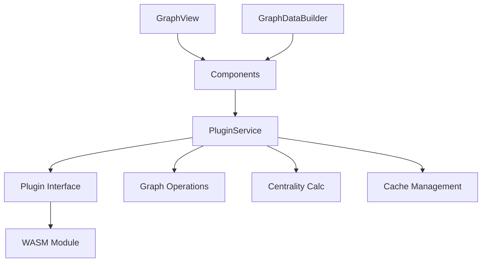
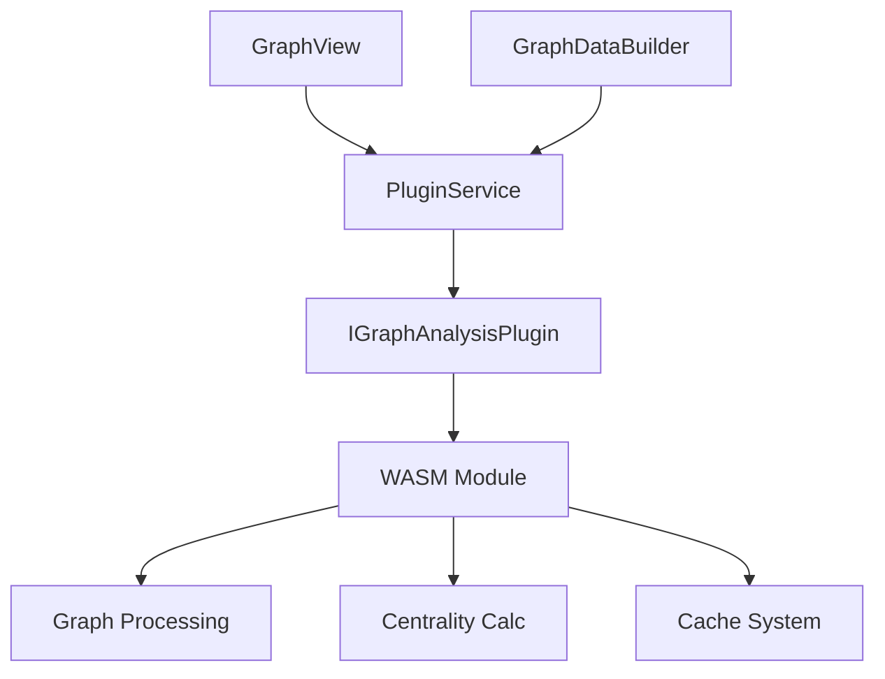

# System Patterns

## Architecture Overview
The system now follows a service-oriented architecture with the Plugin Service pattern at its core, providing centralized access to plugin functionality and optimized graph operations.

## Core Components
1. Service Layer
   - PluginService: Central access point for plugin functionality
   - Type-safe plugin interactions
   - Centralized error handling
   - Unified WASM integration

2. Graph Components
   - GraphView: UI and visualization
   - GraphDataBuilder: Data preparation
   - Combined initialization process
   - Optimized centrality calculations

## Service Pattern Implementation

## Design Patterns
1. Plugin Service Pattern
   - Single point of access
   - Type-safe operations
   - Centralized error handling
   - Clean abstraction layer

2. Graph Initialization Pattern
   - Combined operations
   - Optimized calculations
   - Smart caching
   - On-demand processing

3. Component Communication
   - Service-based interaction
   - Clear dependencies
   - Type-safe interfaces
   - Consistent error handling

## Component Relationships

## Implementation Strategy
1. Service Layer:
   - Centralized plugin access
   - Type-safe operations
   - Error handling
   - Cache management

2. Graph Operations:
   - Combined initialization
   - Optimized calculations
   - Smart caching
   - On-demand processing

3. Future Enhancements:
   - Extended metrics
   - Better caching
   - More analysis tools
   - Enhanced visualization