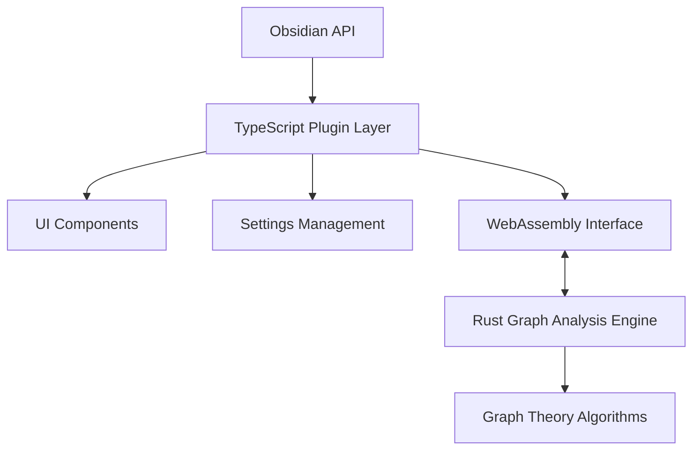
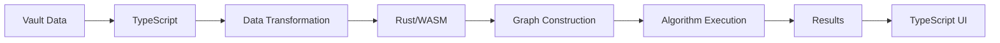

# System Patterns: Obsidian Graph Analysis Plugin

## Architecture Overview
The Obsidian Graph Analysis Plugin follows a hybrid architecture that combines TypeScript for the Obsidian plugin interface and Rust/WebAssembly for performance-critical graph operations.

## Key Components

### TypeScript Plugin Layer
- **Main Plugin Class**: Entry point and initialization
- **Command Registration**: Registers commands in Obsidian
- **Settings Management**: Handles user configuration
- **UI Components**: Results display and interaction
- **WebAssembly Interface**: Communication with Rust code

### Rust/WebAssembly Layer
- **Graph Construction**: Builds graph representation from vault data
- **Centrality Algorithms**: Implements various graph analysis algorithms
- **Result Processing**: Formats and returns analysis results

## Design Patterns

### Observer Pattern
- The plugin observes changes in the Obsidian vault to trigger reanalysis when necessary

### Strategy Pattern
- Different centrality algorithms are implemented as strategies that can be selected at runtime

### Factory Pattern
- Graph construction utilizes factory methods to create appropriate data structures

### Bridge Pattern
- The WebAssembly interface acts as a bridge between TypeScript and Rust code

## Data Flow

## Component Relationships

### Core Dependencies
- The Plugin depends on the Obsidian API
- The TypeScript layer depends on the WebAssembly module
- The WebAssembly module depends on the Rust implementation

### Extension Points
- New centrality algorithms can be added to the Rust implementation
- Additional visualization options can be added to the UI layer
- Settings can be extended to accommodate new features

## Performance Considerations
- Graph construction is done in Rust for performance
- Data transfer between TypeScript and Rust is minimized
- Algorithms are implemented with large graphs in mind
- Fallback mechanisms exist if WebAssembly execution fails

## Error Handling Strategy
- Errors in WebAssembly execution fall back to simpler TypeScript implementations
- User-facing errors are presented with clear explanations
- Console logging provides detailed error information for debugging