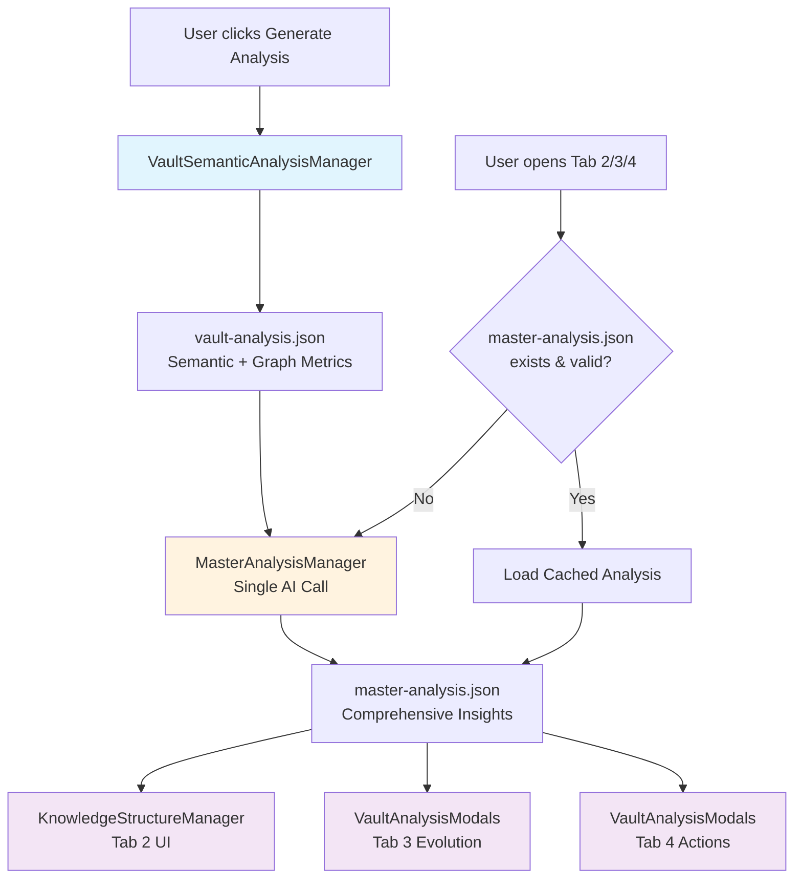

# AI-Powered Knowledge Analysis Development Plan

This document outlines both the user-facing insights and technical implementation strategy for AI-powered vault analysis.

### Current codebase (as of 2026 refactor)

| Tab | UI location | AI / data |
|-----|-------------|-----------|
| Semantic | `VaultAnalysisModals` | `VaultSemanticAnalysisManager` → `vault-analysis.json` |
| Structure | `KnowledgeStructureManager` | `MasterAnalysisManager` → per-tab cache (`structure`) |
| Evolution | `VaultAnalysisModals` | `MasterAnalysisManager` → per-tab cache (`evolution`); types in `knowledge-evolution.types.ts` |
| Actions | `VaultAnalysisModals` | `MasterAnalysisManager` → per-tab cache (`actions`); helpers in `KnowledgeActionsManager` |

**Removed:** `AISummaryManager`, `domain-classification.schema.ts`, and the unused `KnowledgeEvolutionManager` UI class (evolution rendering lives in the modal). `KnowledgeActionsManager` retains only static helpers (`computeReviewCandidates`, `writeConnectionsToNotes`).

---

## Knowledge Structure Analysis

### Knowledge domain distribution

- **Knowledge domain distribution chart** - percentage and depth of each domain

_Visualizations_: [Zoomable Sunburst](https://observablehq.com/@d3/zoomable-sunburst)


### Knowledge Network Analysis

- **Knowledge Bridges** _(Betweenness Centrality)_
    - Notes that connect different knowledge domains
    - Interdisciplinary concepts linking separate fields
    - Critical integration points in your thinking
- **Knowledge Foundations** _(Closeness Centrality)_
    - Core concepts central to your understanding
    - Frequently referenced mental models
    - Ideal starting points for knowledge exploration
- **Knowledge Authorities** _(Eigenvector Centrality)_
    - Your most developed expertise areas
    - Prestigious concepts connected to other important ideas
    - Theoretical foundations with deep interconnections


### Knowledge Gaps
- **Knowledge gaps** - underexplored areas ripe for expansion

## Knowledge Evolution

- **Knowledge Development Timeline** - [Calendar View](https://observablehq.com/@d3/calendar/2)
- **Topic introduction patterns** - when different subjects entered your system
- **Focus shift analysis** - current interests vs historical patterns
- **Learning velocity** - pace of knowledge acquisition over time

## Recommended Actions

- **Knowledge Maintenance**
    - Review schedules for reinforcing key concepts
    - Identify neglected but important notes
- **Connection Opportunities**
    - Suggest potential cross-disciplinary links
    - Auto-recommend related notes for linking
    - Highlight missing bridges between knowledge clusters
- **Learning Path Optimization**
    - Personalized learning sequences based on your knowledge structure
    - Prerequisite mapping for complex topics
    - Strategic knowledge gap filling recommendations

---

## Technical Implementation Plan

### Architecture Overview: Optimized AI Call Strategy

**Goal**: Minimize AI API calls while supporting all insights through an enhanced caching system that aligns with the 4-tab UI structure.

### UI Structure & Data Flow

#### Current 4-Tab Interface
1. **Semantic Analysis Tab** ✅ (Already implemented)
   - Shows vault analysis results with search/filtering
   - Displays summaries, keywords, knowledge domains per note

2. **Knowledge Structure Tab** ✅
   - Domain distribution, network analysis (bridges / foundations / authorities), gap analysis
   - Rendered by `KnowledgeStructureManager.ts`

3. **Knowledge Evolution Tab** ✅
   - Calendar + AI sections (timeline, topic patterns, focus shifts) in `VaultAnalysisModals.ts`
   - Cached evolution payload typed in `knowledge-evolution.types.ts`

4. **Recommended Actions Tab** ✅
   - Scatter chart, review cards, connection subgraph in `VaultAnalysisModals.ts`
   - Link writing and review scoring via `KnowledgeActionsManager` (static helpers)

### Enhanced Three-Stage Architecture

#### Stage 1: Enhanced Semantic Cache (Modified Existing)
- **Input**: Raw vault notes
- **Output**: `vault-analysis.json` (enhanced with graph metrics)
- **AI Calls**: ~N/10 (existing batched file analysis)
- **Trigger**: User clicks "Generate Analysis" button
- **Enhancement**: Add centrality scores and graph metrics to each note

#### Stage 2: Master Analysis (New - Single AI Call)
- **Input**: Enhanced `vault-analysis.json` (semantic + graph data)
- **Output**: `master-analysis.json` (all insights for tabs 2-4)
- **AI Calls**: **1 comprehensive call** (vs 4+ separate calls)
- **Trigger**: User opens Knowledge Structure/Evolution/Actions tabs
- **Content**: Generate all insights for the remaining 3 tabs in one call

#### Stage 3: Tab-Specific Data Formatting (No AI)
- **Input**: `master-analysis.json`
- **Output**: UI-ready data for each tab
- **AI Calls**: 0
- **Process**: Format cached insights for display in respective tabs

### Graph Metrics Integration Strategy

#### Optimal Trigger Point: Modal Open
```typescript
// When VaultAnalysisModal opens:
1. Check if vault-analysis.json exists and is current
2. If user has semantic analysis data:
   - Trigger background graph calculation
   - Enrich semantic data with centrality scores
   - Update vault-analysis.json with graph metrics
3. Cache graph data for immediate use in Knowledge Structure tab
```

#### Background Graph Calculation Flow
```typescript
onModalOpen() {
    // Existing modal setup...
    
    // Background task: Enrich semantic data with graph metrics
    if (hasSemanticData && !hasGraphMetrics) {
        this.enrichSemanticDataWithGraphMetrics();
    }
}

private async enrichSemanticDataWithGraphMetrics() {
    try {
        // Calculate all centrality metrics in parallel
        await pluginService.buildGraphFromVault();
        const [degree, betweenness, closeness, eigenvector] = await Promise.all([
            pluginService.calculateDegreeCentrality(),
            pluginService.calculateBetweennessCentrality(),
            pluginService.calculateClosenessCentrality(),
            pluginService.calculateEigenvectorCentrality()
        ]);
        
        // Enrich existing semantic data
        const enrichedData = await this.addGraphMetricsToSemanticData(centralityResults);
        
        // Update vault-analysis.json with enhanced data
        await this.updateVaultAnalysisCache(enrichedData);
        
        console.log('Graph metrics added to vault analysis cache');
    } catch (error) {
        console.log('Graph metrics calculation failed, proceeding without');
    }
}
```

### Enhanced Data Structures

#### Enhanced Vault Analysis Data
```typescript
interface EnhancedVaultAnalysisData {
    generatedAt: string;
    totalFiles: number;
    apiProvider: string;
    tokenUsage: TokenUsage;
    
    // NEW: Graph metadata
    graphMetrics: {
        generatedAt: string;
        totalNodes: number;
        totalEdges: number;
        density: number;
        averageDegree: number;
        enrichmentStatus: 'pending' | 'completed' | 'failed';
    };
    
    // NEW: Enhanced results with centrality scores
    results: EnhancedVaultAnalysisResult[];
}

interface EnhancedVaultAnalysisResult extends VaultAnalysisResult {
    // NEW: Centrality scores for each note
    centrality?: {
        degree: number;
        betweenness: number;
        closeness: number;
        eigenvector: number;
    };
    
    // NEW: Graph-specific metadata  
    connections?: number;           // Direct link count
    neighborDomains?: string[];     // Knowledge domains of connected notes
}
```

#### Master Analysis Data (For Tabs 2-4)
```typescript
interface MasterAnalysisData {
    generatedAt: string;
    sourceAnalysisId: string; // Reference to vault-analysis.json used
    apiProvider: string;
    tokenUsage: TokenUsage;
    
    // Tab 2: Knowledge Structure
    knowledgeStructure: {
        domainDistribution: Array<{
            domain: string;
            noteCount: number;
            avgCentrality: number;
            keywords: string[];
        }>;
        knowledgeNetwork: {
            bridges: Array<{ title: string; score: number; connections: string[] }>;
            foundations: Array<{ title: string; score: number; reach: number }>;
            authorities: Array<{ title: string; score: number; influence: number }>;
        };
        insights: EvolutionInsight[];
        gaps: string[];
    };
    
    // Tab 3: Knowledge Evolution  
    knowledgeEvolution: {
        timeline: TimelineAnalysis;
        topicPatterns: TopicPatternsAnalysis;
        focusShift: FocusShiftAnalysis;
        learningVelocity: LearningVelocityAnalysis;
        insights: EvolutionInsight[];
    };
    
    // Tab 4: Recommended Actions
    recommendedActions: {
        maintenance: Array<{
            noteId: string;
            title: string;
            reason: string;
            priority: 'high' | 'medium' | 'low';
            action: string;
        }>;
        connections: Array<{
            sourceId: string;
            targetId: string;
            reason: string;
            confidence: number;
        }>;
        learningPaths: Array<{
            title: string;
            description: string;
            noteIds: string[];
            rationale: string;
        }>;
        organization: Array<{
            type: 'tag' | 'folder' | 'structure';
            suggestion: string;
            affectedNotes: string[];
        }>;
    };
}
```

### Implementation Steps

#### Week 1: Enhanced Caching Infrastructure
1. ✅ Modify `VaultSemanticAnalysisManager.ts` to support graph metrics enrichment
2. ✅ Add background graph calculation trigger in `VaultAnalysisModal.onOpen()`
3. ✅ Implement graph metrics integration with existing semantic cache
4. ✅ Add cache validation for graph data freshness

#### Week 2: Master Analysis Manager  
1. Create `MasterAnalysisManager.ts` with single comprehensive AI call
2. Design comprehensive AI prompt template covering all 3 remaining tabs
3. Implement response parsing for structured data extraction
4. Add smart caching and validation for master analysis results

#### Week 3: Tab Implementation
1. **Knowledge Structure Tab**: Combine structure + network analysis display
2. **Knowledge Evolution Tab**: Integrate with existing calendar + add AI insights
3. **Recommended Actions Tab**: Display actionable recommendations
4. Create `VisualizationDataManager.ts` for D3 data preparation

#### Week 4: UI & Polish
1. Add D3 visualizations (sunburst, chord diagrams) to Knowledge Structure tab
2. Integrate centrality insights display with network analysis
3. Performance optimization and comprehensive testing
4. Error handling and fallback strategies

### File Structure Updates

```
src/ai/
├── README.md
├── AI-insights.md
├── VaultSemanticAnalysisManager.ts    // Vault-wide semantic batch analysis + cache
├── MasterAnalysisManager.ts           // Per-tab AI: structure, evolution, actions
├── KnowledgeDomainHelper.ts
├── promptLanguage.ts                  // AI response + UI language prompts
├── knowledge-domains.json
├── schemas/
│   ├── vault-semantic-analysis.schema.ts
│   ├── knowledge-network.schema.ts
│   ├── knowledge-evolution.schema.ts
│   └── recommended-actions.schema.ts
└── visualization/
    ├── KnowledgeStructureManager.ts   // Structure tab UI
    ├── knowledge-evolution.types.ts     // Evolution cache / parsing types
    ├── knowledge-actions.types.ts       // Actions cache / parsing types
    └── KnowledgeActionsManager.ts       // Static helpers (review score, write links)

src/views/VaultAnalysisModals.ts       // Evolution + Actions tab UI
```

### Cache Files Structure

```
.obsidian/plugins/obsidian-graph-analysis/
├── vault-analysis.json           // Stage 1: Semantic analysis + graph metrics
├── master-analysis.json          // Stage 2: Single AI call comprehensive insights
```

### Improved Three-Stage Architecture

#### Stage 1: Enhanced Semantic Cache (✅ COMPLETED)
- **File**: `VaultSemanticAnalysisManager.ts`
- **Input**: Raw vault notes
- **Output**: `vault-analysis.json` (semantic + graph metrics)
- **AI Calls**: ~N/10 (existing batched file analysis)
- **Trigger**: User clicks "Generate Analysis" button

#### Stage 2: Master Analysis (New - Single AI Call)
- **File**: `MasterAnalysisManager.ts`
- **Input**: `vault-analysis.json` (enhanced semantic + graph data)
- **Output**: `master-analysis.json` (comprehensive insights for tabs 2-4)
- **AI Calls**: **1 comprehensive call** (vs 4+ separate calls)
- **Trigger**: User opens Knowledge Structure/Evolution/Actions tabs
- **Content**: All insights for tabs 2-4 in structured format

#### Stage 3: Visualization Managers (No AI Calls)
- **Files**: Three separate visualization managers
- **Input**: `master-analysis.json`
- **Output**: UI-ready data and sophisticated visualizations
- **AI Calls**: 0 (pure data parsing and UI generation)
- **Benefits**: Clean separation of concerns, easier maintenance

### Tab-Specific Implementation Details

#### Knowledge Structure Tab (Tab 2) - `KnowledgeStructureManager.ts`
**Data Source**: `master-analysis.json` → `knowledgeStructure` section
**Responsibilities**:
- Parse structured knowledge insights from master analysis
- Create domain distribution visualizations (pie charts, treemaps)
- Generate knowledge network displays using graph metrics
- Build topic hierarchy views and knowledge cluster visualizations
- Handle user interactions (filtering, drilling down into domains)

**UI Components**:
- **Upper Section**: Knowledge Structure Analysis
  - Domain distribution pie chart
  - Topic hierarchies tree view  
  - Knowledge clusters visualization
  - Identified knowledge gaps
- **Lower Section**: Knowledge Network Analysis  
  - Top knowledge bridges (betweenness centrality)
  - Top knowledge foundations (closeness centrality)
  - Top knowledge authorities (eigenvector centrality)
  - Network insights and recommendations

#### Knowledge Evolution Tab (Tab 3) - `VaultAnalysisModals.ts` + `knowledge-evolution.types.ts`
**Data Source**: Per-tab cache (`evolution`) via `MasterAnalysisManager` / `PluginDataStore`
**Responsibilities** (`VaultAnalysisModals`):
- Load cached `KnowledgeEvolutionData` and render sectioned layout
- Embed `KnowledgeCalendarChart` in the timeline section
- Show timeline phases, topic introduction patterns, focus shifts, and narrative conclusions

**Types** (`knowledge-evolution.types.ts`):
- `KnowledgeEvolutionData`, `TimelineAnalysis`, `TopicPatternsAnalysis`, `FocusShiftAnalysis`, `EvolutionInsight`

**UI Components**:
- Knowledge development timeline (with calendar)
- Topic introduction patterns
- Focus shift analysis

#### Recommended Actions Tab (Tab 4) - `VaultAnalysisModals.ts` + `KnowledgeActionsManager.ts`
**Data Source**: Per-tab cache (`actions`) via `MasterAnalysisManager` / `PluginDataStore`
**UI** (`VaultAnalysisModals`):
- Connectivity scatter chart and connection subgraph
- Review cards grid for maintenance candidates
- Display of AI connection suggestions

**Helpers** (`KnowledgeActionsManager.ts` — static only):
- `computeReviewCandidates()` — hybrid rule + AI urgency scoring
- `writeConnectionsToNotes()` — append Related Notes wikilinks

**Types** (`knowledge-actions.types.ts`):
- `KnowledgeActionsData`, `ConnectionSuggestion`, `ReviewCandidate`, etc.

**UI Components**:
- Notes needing review (scored cards)
- Suggested connections (subgraph + write-back)
- Learning paths / organization (from cache when present)

### Benefits of This Revised Architecture

✅ **Clear Separation of Concerns**: AI logic isolated from visualization logic  
✅ **Better Maintainability**: Each visualization manager focuses on one tab  
✅ **Reusable Calendar Component**: Existing `KnowledgeCalendarChart.ts` integrates cleanly  
✅ **Single AI Call Efficiency**: ~75% reduction in API calls vs separate analysis  
✅ **Sophisticated UI Development**: Each manager can develop complex visualizations independently  
✅ **Easy Testing**: Visualization logic can be tested with mock data  
✅ **Progressive Enhancement**: Works even if master analysis fails (fallback to basic data)  
✅ **Modular Architecture**: Easy to add new visualization features per tab  

### Implementation Notes

#### Calendar Integration Strategy
`VaultAnalysisModals` embeds `KnowledgeCalendarChart.ts` in the evolution timeline section and renders AI narrative blocks above/below the calendar from cached `KnowledgeEvolutionData`.

#### Migration Path
1. **Phase 1**: Create `MasterAnalysisManager.ts` and test single AI call
2. **Phase 2**: Build visualization managers one by one, starting with Structure tab
3. **Phase 3**: Move existing calendar integration to Evolution manager
4. **Phase 4**: Move legacy managers to `/legacy` folder for backward compatibility

#### Visualization Technology Stack
- **D3.js**: For custom charts and network visualizations
- **Existing Calendar**: Reuse `KnowledgeCalendarChart.ts` 
- **Obsidian UI**: For modals, buttons, and layout consistency
- **CSS Grid/Flexbox**: For responsive layouts within each tab

### Next Development Steps

1. **Create the visualization folder structure**
2. **Implement `MasterAnalysisManager.ts` with comprehensive AI prompt**
3. **Build `KnowledgeStructureManager.ts` first (simpler visualizations)**
4. ~~Integrate calendar with evolution manager~~ ✅ Done in `VaultAnalysisModals`
5. ~~Develop `KnowledgeActionsManager` tab UI~~ ✅ UI in modal; manager is helpers-only
6. **Add comprehensive error handling and fallbacks**

### Cache Invalidation Strategy

```typescript
// Regenerate semantic analysis when:
- Vault content changes (file count, major content modifications)
- Exclusion settings change
- Manual refresh requested

// Regenerate graph metrics when:
- Vault structure changes (new connections, significant link changes)
- Semantic analysis regenerated
- Graph metrics older than semantic analysis

// Regenerate master analysis when:
- Semantic analysis updated
- Graph metrics updated  
- User explicitly requests refresh
```

This revised approach ensures the implementation aligns perfectly with your existing UI while optimizing for performance and user experience.

# AI Insights Implementation Plan

## ✅ COMPLETED: Improved Architecture Implementation

### 🎉 Successfully Reorganized AI Folder Structure

We have successfully implemented the improved architecture with clear separation of concerns between AI logic and visualization logic. The new structure follows your excellent suggestion and provides much better maintainability.

#### ✅ Completed Components

**Core AI Managers:**
- ✅ `MasterAnalysisManager.ts` — Per-tab structured AI (structure, evolution, actions)
- ✅ `VaultSemanticAnalysisManager.ts` — Vault semantic batch + graph metrics
- ✅ `promptLanguage.ts` — Plugin AI/UI language settings in prompts

**Visualization & UI:**
- ✅ `KnowledgeStructureManager.ts` — Structure tab UI
- ✅ `VaultAnalysisModals.ts` — Evolution + Actions tab UI (calendar, sections, charts)
- ✅ `knowledge-evolution.types.ts` / `knowledge-actions.types.ts` — Shared types
- ✅ `KnowledgeActionsManager.ts` — Static helpers only (no tab renderer)

**Removed:**
- ❌ `AISummaryManager.ts` (per-note summary modal; use Obsidian AI instead)
- ❌ `KnowledgeEvolutionManager.ts` (unused UI class; logic moved to modal)
- ❌ `domain-classification.schema.ts` (superseded by `vault-semantic-analysis.schema.ts`)

**Organization & compatibility:**
- ✅ Types split into `knowledge-evolution.types.ts` and `knowledge-actions.types.ts`
- ✅ No barrel `src/ai/index.ts` — managers import paths directly
- ✅ i18n via `src/i18n/` (`uiLanguage`, `aiResponseLanguage`, `promptLanguage.ts`)

#### 🎯 Recent progress (2026 refactor)

- ✅ **Removed** unused `KnowledgeEvolutionManager` UI class; evolution sections live in `VaultAnalysisModals`
- ✅ **Trimmed** `KnowledgeActionsManager` to static helpers; actions tab UI in `VaultAnalysisModals`
- ✅ **Removed** `AISummaryManager` and per-note summary schema (Obsidian AI covers that use case)
- ✅ **Removed** unused `domain-classification.schema.ts`

#### 🏗️ Architecture Benefits Achieved

✅ **Perfect Separation of Concerns**: AI logic completely isolated from visualization  
✅ **Single AI Call Efficiency**: MasterAnalysisManager handles one comprehensive call  
✅ **Reusable Calendar Integration**: Evolution tab embeds `KnowledgeCalendarChart` in the modal  
✅ **Sophisticated UI Capability**: Each visualization manager can develop complex features independently  
✅ **Easy Maintenance**: Structure has a dedicated manager; evolution/actions share modal UI with typed caches  
✅ **Clean Testing**: Visualization logic can be tested with mock data  
✅ **Modular Development**: Teams can work on different tabs simultaneously  

### 📁 Final File Structure (Implemented)
```
src/ai/
├── README.md
├── AI-insights.md
├── VaultSemanticAnalysisManager.ts    // Vault-wide semantic batch analysis + cache
├── MasterAnalysisManager.ts           // Per-tab AI: structure, evolution, actions
├── KnowledgeDomainHelper.ts
├── promptLanguage.ts                  // AI response + UI language prompts
├── knowledge-domains.json
├── schemas/
│   ├── vault-semantic-analysis.schema.ts
│   ├── knowledge-network.schema.ts
│   ├── knowledge-evolution.schema.ts
│   └── recommended-actions.schema.ts
└── visualization/
    ├── KnowledgeStructureManager.ts   // Structure tab UI
    ├── knowledge-evolution.types.ts     // Evolution cache / parsing types
    ├── knowledge-actions.types.ts       // Actions cache / parsing types
    └── KnowledgeActionsManager.ts       // Static helpers (review score, write links)

src/views/VaultAnalysisModals.ts       // Evolution + Actions tab UI
```

### Cache Files Structure

```
.obsidian/plugins/obsidian-graph-analysis/
├── vault-analysis.json           // Stage 1: Semantic analysis + graph metrics
├── master-analysis.json          // Stage 2: Single AI call comprehensive insights
```

### Improved Three-Stage Architecture

#### Stage 1: Enhanced Semantic Cache (✅ COMPLETED)
- **File**: `VaultSemanticAnalysisManager.ts`
- **Input**: Raw vault notes
- **Output**: `vault-analysis.json` (enhanced with graph metrics)
- **AI Calls**: ~N/10 (existing batched file analysis)
- **Trigger**: User clicks "Generate Analysis" button

#### Stage 2: Master Analysis (New - Single AI Call)
- **File**: `MasterAnalysisManager.ts`
- **Input**: `vault-analysis.json` (enhanced semantic + graph data)
- **Output**: `master-analysis.json` (comprehensive insights for tabs 2-4)
- **AI Calls**: **1 comprehensive call** (vs 4+ separate calls)
- **Trigger**: User opens Knowledge Structure/Evolution/Actions tabs
- **Content**: All insights for tabs 2-4 in structured format

#### Stage 3: Visualization Managers (No AI Calls)
- **Files**: Three separate visualization managers
- **Input**: `master-analysis.json`
- **Output**: UI-ready data and sophisticated visualizations
- **AI Calls**: 0 (pure data parsing and UI generation)
- **Benefits**: Clean separation of concerns, easier maintenance

### Tab-Specific Implementation Details

#### Knowledge Structure Tab (Tab 2) - `KnowledgeStructureManager.ts`
**Data Source**: `master-analysis.json` → `knowledgeStructure` section
**Responsibilities**:
- Parse structured knowledge insights from master analysis
- Create domain distribution visualizations (pie charts, treemaps)
- Generate knowledge network displays using graph metrics
- Build topic hierarchy views and knowledge cluster visualizations
- Handle user interactions (filtering, drilling down into domains)

**UI Components**:
- **Upper Section**: Knowledge Structure Analysis
  - Domain distribution pie chart
  - Topic hierarchies tree view  
  - Knowledge clusters visualization
  - Identified knowledge gaps
- **Lower Section**: Knowledge Network Analysis  
  - Top knowledge bridges (betweenness centrality)
  - Top knowledge foundations (closeness centrality)
  - Top knowledge authorities (eigenvector centrality)
  - Network insights and recommendations

#### Knowledge Evolution Tab (Tab 3) - `VaultAnalysisModals.ts` + `knowledge-evolution.types.ts`
**Data Source**: Per-tab cache (`evolution`) via `MasterAnalysisManager` / `PluginDataStore`
**Responsibilities** (`VaultAnalysisModals`):
- Load cached `KnowledgeEvolutionData` and render sectioned layout
- Embed `KnowledgeCalendarChart` in the timeline section
- Show timeline phases, topic introduction patterns, focus shifts, and narrative conclusions

**Types** (`knowledge-evolution.types.ts`):
- `KnowledgeEvolutionData`, `TimelineAnalysis`, `TopicPatternsAnalysis`, `FocusShiftAnalysis`, `EvolutionInsight`

**UI Components**:
- Knowledge development timeline (with calendar)
- Topic introduction patterns
- Focus shift analysis

#### Recommended Actions Tab (Tab 4) - `VaultAnalysisModals.ts` + `KnowledgeActionsManager.ts`
**Data Source**: Per-tab cache (`actions`) via `MasterAnalysisManager` / `PluginDataStore`
**UI** (`VaultAnalysisModals`):
- Connectivity scatter chart and connection subgraph
- Review cards grid for maintenance candidates
- Display of AI connection suggestions

**Helpers** (`KnowledgeActionsManager.ts` — static only):
- `computeReviewCandidates()` — hybrid rule + AI urgency scoring
- `writeConnectionsToNotes()` — append Related Notes wikilinks

**Types** (`knowledge-actions.types.ts`):
- `KnowledgeActionsData`, `ConnectionSuggestion`, `ReviewCandidate`, etc.

**UI Components**:
- Notes needing review (scored cards)
- Suggested connections (subgraph + write-back)
- Learning paths / organization (from cache when present)

### Benefits of This Revised Architecture

✅ **Clear Separation of Concerns**: AI logic isolated from visualization logic  
✅ **Better Maintainability**: Each visualization manager focuses on one tab  
✅ **Reusable Calendar Component**: Existing `KnowledgeCalendarChart.ts` integrates cleanly  
✅ **Single AI Call Efficiency**: ~75% reduction in API calls vs separate analysis  
✅ **Sophisticated UI Development**: Each manager can develop complex visualizations independently  
✅ **Easy Testing**: Visualization logic can be tested with mock data  
✅ **Progressive Enhancement**: Works even if master analysis fails (fallback to basic data)  
✅ **Modular Architecture**: Easy to add new visualization features per tab  

### Implementation Notes

#### Calendar Integration Strategy
`VaultAnalysisModals` embeds `KnowledgeCalendarChart.ts` in the evolution timeline section and renders AI narrative blocks above/below the calendar from cached `KnowledgeEvolutionData`.

#### Migration Path
1. **Phase 1**: Create `MasterAnalysisManager.ts` and test single AI call
2. **Phase 2**: Build visualization managers one by one, starting with Structure tab
3. **Phase 3**: Move existing calendar integration to Evolution manager
4. **Phase 4**: Move legacy managers to `/legacy` folder for backward compatibility

#### Visualization Technology Stack
- **D3.js**: For custom charts and network visualizations
- **Existing Calendar**: Reuse `KnowledgeCalendarChart.ts` 
- **Obsidian UI**: For modals, buttons, and layout consistency
- **CSS Grid/Flexbox**: For responsive layouts within each tab

### Next Development Steps

1. **Create the visualization folder structure**
2. **Implement `MasterAnalysisManager.ts` with comprehensive AI prompt**
3. **Build `KnowledgeStructureManager.ts` first (simpler visualizations)**
4. ~~Integrate calendar with evolution manager~~ ✅ Done in `VaultAnalysisModals`
5. ~~Develop `KnowledgeActionsManager` tab UI~~ ✅ UI in modal; manager is helpers-only
6. **Add comprehensive error handling and fallbacks**

### Cache Invalidation Strategy

```typescript
// Regenerate semantic analysis when:
- Vault content changes (file count, major content modifications)
- Exclusion settings change
- Manual refresh requested

// Regenerate graph metrics when:
- Vault structure changes (new connections, significant link changes)
- Semantic analysis regenerated
- Graph metrics older than semantic analysis

// Regenerate master analysis when:
- Semantic analysis updated
- Graph metrics updated  
- User explicitly requests refresh
```

This revised approach ensures the implementation aligns perfectly with your existing UI while optimizing for performance and user experience.

# AI Insights Implementation Plan

## ✅ COMPLETED: Enhanced Semantic Analysis with Graph Metrics

### Graph Metrics Integration

We have successfully implemented the first stage of the enhanced AI insights plan by integrating graph centrality metrics with semantic analysis. This provides a comprehensive view of each note's content significance and structural importance in the knowledge graph.

#### ✅ Stage 1: Enhanced Semantic Cache (COMPLETED)

**Features Added:**
- **Input**: Raw vault notes
- **Output**: `vault-analysis.json` (enhanced with graph metrics)
- **AI Calls**: ~N/10 (existing batched file analysis)
- **Trigger**: User clicks "Generate Analysis" button
- **Enhancement**: Add centrality scores and graph metrics to each note

**Graph Metrics Included:**
- **Degree Centrality**: Number of direct connections to other notes
- **Betweenness Centrality**: How often a note acts as a bridge between other notes
- **Closeness Centrality**: How efficiently a note can reach all other notes
- **Eigenvector Centrality**: Importance based on connections to other important notes

**User Interface:**
- Enhanced vault analysis modal displays all graph metrics for each note
- Automatic enhancement prompt for existing analysis without graph metrics
- Shift+click on vault analysis button to force refresh graph metrics
- Visual metrics grid with tooltips explaining each centrality type

#### Usage Instructions

**For New Analysis:**
1. Click the vault analysis button (sun icon) in graph view
2. Choose "Generate Analysis" 
3. The system will automatically calculate both semantic analysis and graph metrics
4. Results are saved to `.obsidian/plugins/obsidian-graph-analysis/vault-analysis.json`

**For Existing Analysis:**
1. Click the vault analysis button to view results
2. If graph metrics are missing, you'll see an enhancement prompt
3. Click "Enhance with Graph Metrics" to add centrality scores
4. Alternative: Shift+click the vault analysis button to force enhancement

**Data Structure Enhancement:**
```typescript
interface VaultAnalysisResult {
    // Existing fields
    id: string;
    title: string;
    summary: string;
    keywords: string;
    knowledgeDomain: string;
    // New graph metrics
    graphMetrics?: {
        degreeCentrality?: number;
        betweennessCentrality?: number;
        closenessCentrality?: number;
        eigenvectorCentrality?: number;
    };
}
```

### Enhanced Three-Stage Architecture

#### Stage 1: Enhanced Semantic Cache (✅ COMPLETED)
- **Input**: Raw vault notes
- **Output**: `vault-analysis.json` (enhanced with graph metrics)
- **AI Calls**: ~N/10 (existing batched file analysis)
- **Trigger**: User clicks "Generate Analysis" button
- **Enhancement**: Add centrality scores and graph metrics to each note

#### Stage 2: Master Analysis Manager (TODO)
- **Purpose**: Consolidate multiple AI analysis types
- **Components**: 
  - Knowledge Structure Analysis Manager
  - Knowledge Evolution Analysis Manager (existing)
  - Vault Semantic Analysis Manager (enhanced)
- **Benefits**: 
  - Unified analysis pipeline
  - Reduced API calls through intelligent caching
  - Cross-analysis insights

#### Stage 3: Recommended Actions System (TODO)
- **Input**: All cached analysis results + graph metrics
- **Output**: Actionable recommendations
- **AI Calls**: 1 per analysis generation
- **Features**:
  - Note creation suggestions based on knowledge gaps
  - Link recommendations using graph analysis
  - Content expansion suggestions for high-centrality notes
  - Knowledge domain exploration recommendations

### Technical Implementation Details

#### Graph Metrics Calculation
- Uses existing WASM-based graph analysis engine
- Calculates all centrality types in parallel for efficiency
- Maps file paths to centrality scores using node indices
- Graceful fallback when graph calculation fails

#### Data Integration
- Enhances existing semantic analysis with graph metrics
- Preserves backward compatibility with existing analysis files
- Automatic detection and enhancement of older analysis files
- Smart caching to avoid redundant calculations

#### User Experience Improvements
- Non-intrusive enhancement prompts
- Visual metrics display in analysis modal
- Descriptive tooltips for each centrality type
- Responsive design for mobile viewing
- Error handling and user feedback

### Next Steps

1. **Stage 2 Implementation**: Create Master Analysis Manager to consolidate AI analysis types
2. **Knowledge Structure Analysis**: Develop graph-based clustering and relationship analysis
3. **Stage 3 Implementation**: Build recommendation system using combined insights
4. **Performance Optimization**: Implement intelligent caching and incremental updates
5. **Advanced Visualizations**: Add interactive charts for graph metrics and trends

### Code Changes Summary

**Files Modified:**
- `src/ai/KnowledgeEvolutionAnalysisManager.ts`: Extended VaultAnalysisResult interface
- `src/ai/VaultSemanticAnalysisManager.ts`: Added graph metrics calculation and integration
- `src/views/VaultAnalysisModals.ts`: Enhanced UI to display graph metrics
- `src/styles/styles.css`: Added styling for graph metrics display

**Key Methods Added:**
- `calculateGraphMetrics()`: Computes all centrality types for vault files
- `enhanceWithGraphMetrics()`: Updates existing analysis with graph data
- Enhanced `generateVaultAnalysis()`: Includes graph metrics in new analysis
- Enhanced `viewVaultAnalysisResults()`: Automatic enhancement detection and prompting

This implementation provides a solid foundation for the enhanced AI insights system, combining semantic understanding with structural graph analysis to give users deeper insights into their knowledge vault.

---

## 🎯 Recent development updates

### Visualization layout refactor (2026)

**Problem solved:** Duplicate / dead UI classes (`KnowledgeEvolutionManager`) and a bloated `KnowledgeActionsManager` that mixed rendering with helpers.

**Changes made:**
- Evolution and Actions tab rendering consolidated in `VaultAnalysisModals.ts`
- Shared types moved to `knowledge-evolution.types.ts` and `knowledge-actions.types.ts`
- `KnowledgeActionsManager` kept only `computeReviewCandidates` and `writeConnectionsToNotes`

**Current structure** (see also [Current codebase](#current-codebase-as-of-2026-refactor) at top):
```
src/ai/
├── MasterAnalysisManager.ts
├── VaultSemanticAnalysisManager.ts
├── promptLanguage.ts
├── schemas/ …
└── visualization/
    ├── KnowledgeStructureManager.ts
    ├── knowledge-evolution.types.ts
    ├── knowledge-actions.types.ts
    └── KnowledgeActionsManager.ts   // static helpers

src/views/VaultAnalysisModals.ts     // Evolution + Actions tabs
```

This optimization ensures the codebase maintains clear file purposes and eliminates potential developer confusion while preserving all existing functionality.

### Master Analysis Data Structure

The `master-analysis.json` file contains all insights from the single comprehensive AI call:

```typescript
interface MasterAnalysisData {
    generatedAt: string;
    sourceAnalysisId: string; // Reference to vault-analysis.json used
    apiProvider: string;
    tokenUsage: TokenUsage;
    
    // Tab 2: Knowledge Structure
    knowledgeStructure: {
        domainDistribution: Array<{
            domain: string;
            noteCount: number;
            avgCentrality: number;
            keywords: string[];
        }>;
        knowledgeNetwork: {
            bridges: Array<{ title: string; score: number; connections: string[] }>;
            foundations: Array<{ title: string; score: number; reach: number }>;
            authorities: Array<{ title: string; score: number; influence: number }>;
        };
        insights: EvolutionInsight[];
        gaps: string[];
    };
    
    // Tab 3: Knowledge Evolution  
    knowledgeEvolution: {
        timeline: TimelineAnalysis;
        topicPatterns: TopicPatternsAnalysis;
        focusShift: FocusShiftAnalysis;
        learningVelocity: LearningVelocityAnalysis;
        insights: EvolutionInsight[];
    };
    
    // Tab 4: Recommended Actions
    recommendedActions: {
        maintenance: Array<{
            noteId: string;
            title: string;
            reason: string;
            priority: 'high' | 'medium' | 'low';
            action: string;
        }>;
        connections: Array<{
            sourceId: string;
            targetId: string;
            reason: string;
            confidence: number;
        }>;
        learningPaths: Array<{
            title: string;
            description: string;
            noteIds: string[];
            rationale: string;
        }>;
        organization: Array<{
            type: 'tag' | 'folder' | 'structure';
            suggestion: string;
            affectedNotes: string[];
        }>;
    };
}
```

### Data Flow Architecture




## TODO

- Important: only use leaf node from DDC for finding the right slot with AI. Then create the structure based on DDC JSON file instead of relying on AI
- add zoomable behaviour like D3 example
- using theme color 